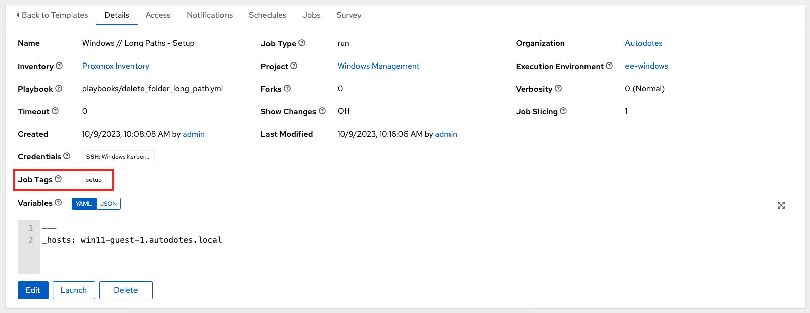
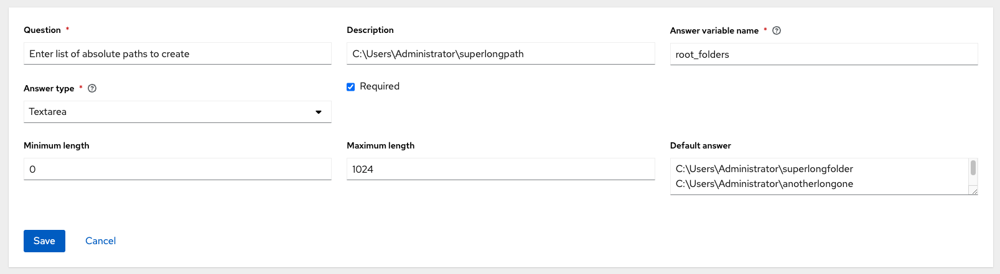
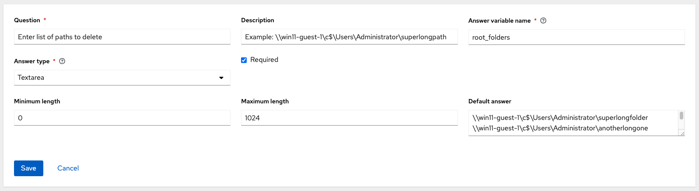

# Delete Long Paths

Requirements:
- Active Directory domain controller
- [Windows Domain Admin](https://docs.autodotes.com/Ansible/Credential%20Types/microsoft_ad_admin/) custom credential

Objectives:
1. Setup directories with long file paths (optional if already exist)
2. Delete directories from another (mgmt) server

## Playbook

[delete_folder_long_path.yml](../delete_folder_long_path.yml)

### Tags

`--tags <tag>`

- setup -> create the test directory structure with long folder paths
- delete -> actually perform the delete on specified folders
- _none_ -> setup test directories before deletion (e2e test run)

### Input Vars

| Name | Description | Example |
| --- | --- | --- |
| root_folders | A set of root folders to delete or setup | `<base>\superlongfolder` `<base>\anotherlongone` `<base>\whyarethesenamessolong` |
| folders | Used for test setup scenarios, a list of long subfolder paths to create (each item must build on the previous) | `- this\is` `- this\is\super` `- this\is\super\long` |

### Steps

1. Set the registry key for `EnableLongPaths` to perform actions
1. Create the test directories (if tags apply)
1. Delete the specified directory (if tags apply)
1. Unset the registry key for `EnableLongPaths`

## Job Templates

### Windows // Long Folder Paths - Setup

 

### Windows // Long Folder Paths - Delete

 

## Gotchas

If you are using kerberos to authenticate with a domain account, then credential delegation is required when deleting folders at remote destinations. Refer to the [Ansible Kerberos](https://docs.ansible.com/ansible/latest/os_guide/windows_winrm.html#kerberos) docs for more information.